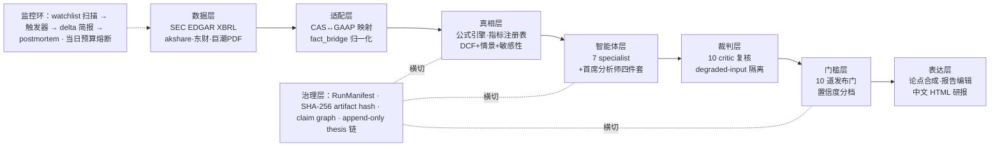

# Aegis Research OS — AI 多智能体基本面投研系统

> 一个 ticker 进，一份带证据链、批评审核与发布门槛的深度研报出。
> 它的核心立场是：**LLM 分析师的叙述不可轻信**——所以整套工程都围绕一个问题展开：
> 怎样让一群 LLM 分析师的产出变得可以被审计、被复核、被信任。

[](https://github.com/9205608-hub/aegis-research-os/actions/workflows/tests.yml)
[](LICENSE)
[](pyproject.toml)
[](tests/)
[](aegis/core/agents/)
[-orange.svg)](aegis/core/acquisition/connectors/)

*详细说明书：[docs/使用指南.md](docs/使用指南.md) · English summary at the [bottom](#english-brief)*

## ✨ 它能做什么

- **端到端管线**：ticker → 财报获取（美股 SEC EDGAR XBRL / A 股 akshare·东财·巨潮）→
  会计准则适配（CAS ↔ US GAAP 概念映射）→ 指标计算 → DCF + 情景 + 敏感性 →
  7 位专家 agent → 10 道 critic 复核 → 发布门槛 → 论点合成 → 报告编辑 →
  中文 HTML 研报（主编排 `aegis/core/orchestrator/auto_research.py`，Step 0–17）；
- **多智能体分工**：7 位 specialist（会计 / 业务 / 行业 / 管理层 / 估值 / 变体 /
  风险，`aegis/core/agents/llm_agents.py`）+ 首席分析师四件套（Research Director
  前置定调、Thesis Synthesizer 论点合成、Scenario Architect 情景叙事、Report
  Editor 终稿编辑，`aegis/core/chief_analyst/`）；
- **裁判与门槛**：11 个 critic 实现（单票主流程跑 10 个，跨实体 critic 在多标的
  对比模式启用，`aegis/core/critics/`）+ 10 道发布门（truth / definition /
  evidence / critic / cognitive_bias / reproducibility / accounting_integrity /
  warn_accumulation / logical_consistency / data_quality，
  `aegis/core/publish_gate/gate.py`）——Publishable = 全部通过，不过门降置信度或不发布；
- **证据链留痕**：核心结论无 evidence_id 不得进 thesis（claim graph，
  `aegis/core/evidence/claim_graph/`）；每次 run 生成 RunManifest 冻结全部版本
  上下文 + SHA-256 artifact hash（`aegis/core/governance/`）；thesis 版本走
  append-only JSONL 链（`aegis/core/thesis/persistence.py`）；
- **不轻信 LLM 数字**：数字一致性 critic、报告数字清洗白名单（首页数字卡 /
  synthesizer / editor 三处设防）、degraded-input 隔离——LLM 兜底产物的警告
  单独计数，不投毒真实告警与置信度（`aegis/core/critics/degraded_input.py`）；
- **成本工程**：LLM 磁盘缓存按 prompt 指纹命中（`aegis/core/llm/cached_client.py`）、
  `scripts/replay_from_cache.py` 秒级重渲染、`UPDATE=1` 增量模式（基本面未变时
  零 LLM 调用）、当日成本熔断器（跨进程台账，`aegis/core/monitor/budget.py`）、
  每 run 成本汇总打印（CostTracker）；
- **校准闭环**：发布时记录预测 → 复盘 postmortem → 校准报告 → 置信度策略反馈
  （`aegis/core/memory/calibration_loop.py`）；
- **A 股另类数据摄取（L1）**：分部收入、客户集中度（巨潮年报 PDF 抽取）、解禁
  日历、股权质押（中登快照 + 东财明细双路对账）、股东户数、两融、龙虎榜——
  每个连接器的数据陷阱（百分数 vs 小数、升序表、IPO 前静态行、陈旧明细）都有
  防御代码和回归测试（`aegis/core/acquisition/connectors/`）；
- **事件驱动监控**：watchlist 扫描 → 触发器 → 论点 delta 简报 → postmortem
  （`aegis/core/monitor/`；现为纯手动触发，见下"设计边界与诚实局限"）。

## 🗺️ 系统全景



## 📈 报告长什么样

五份冒烟报告随仓库携带（`demos/smoke/`，clone 后用浏览器直接打开）：
[NVDA](demos/smoke/nvda_fy2026_auto_report.html) ·
[贵州茅台 600519](demos/smoke/600519_fy2025_auto_report.html) ·
[康达新材 002669](demos/smoke/002669_fy2025_auto_report.html) ·
[特变电工 600089](demos/smoke/600089_fy2025_auto_report.html) ·
[中珠 600568](demos/smoke/600568_fy2025_auto_report.html)。
报告含：执行摘要与投资论点、DCF 三情景与敏感性分析、各专家视角的分析章节、
时效性警告 banner（数据源落后超 15 个月时强制显示）。注意这五份是**规则模式**
产物（零 LLM，用于验管道）；全量 LLM run 的报告在论点深度、agent 分歧与
critic 复核痕迹上远厚于此。发布门槛与红旗判定结果输出在运行日志与 thesis
持久化产物中。

## 🚀 快速开始

```bash
pip install -e ".[dev]"
pytest -q                        # 1977 passed / 7 skipped，全部离线（本机实测 12s）
./run_research.sh --smoke NVDA   # 冒烟：规则模式，零 LLM 调用，无需 LLM key，<5min
```

全量 LLM run（需要 DeepSeek API key，从环境注入，**绝不写进仓库文件**）：

```bash
export DEEPSEEK_API_KEY="sk-..."   # 或写进 run_research.local.sh（已 gitignore，入口自动 source）
./run_research.sh 300502           # A 股全量 run（中文研报）
./run_research.sh NVDA             # 美股全量 run
UPDATE=1 ./run_research.sh 300502  # 增量模式：基本面未变时复用上次分析，零 LLM 调用
./run_server.sh                    # 本地 Web 台：搜索 / SSE 实时进度 / 报告浏览
```

单票全量 run 的实测量级：约 20–30 分钟、约 20+ 次 LLM 调用、约 $0.2–0.3
（DeepSeek 后端，300502 实测 29min / 23 调用 / $0.22，记录见 HANDOFF.md
2026-08-01 条目）。每个入口做什么、参数怎么调、报告怎么读 →
**[docs/使用指南.md](docs/使用指南.md)**。

## 🧱 设计上的几条硬规矩（都有血泪出处，记录在案）

- **时效性铁律**：分析必须反映当前可得的最新财报期；美股 probe EDGAR 自动选
  最新 10-K，A 股由数据源真实 fiscal_year 回写；数据源落后超 15 个月，报告
  顶部强制橙色警告（出处：拿 FY2024 数据分析 NVDA 现价的事故，HANDOFF BUG-21）；
- **不轻信 LLM 输出的数字**：LLM 会编算术不闭合的数字（"净负债 47 亿 = 75 亿 −
  15 亿"），prompt 硬约束 + 数字一致性 critic + 清洗白名单三层兜底；
- **连接器永不 raise**：任何数据源失败降级为"缺失"而非崩管线；负面证据（无
  质押登记、未上龙虎榜）也注入，宁缺毋滥；
- **盖章只在 orchestrator**：数据连接器不触共享事实字典，数据来源标注统一在
  编排层完成——数据溯源不散落；
- **预算有熔断**：无人值守烧 API 的事故（2026-08-04，单日 $5.49）直接催生了
  当日成本熔断器与"零自主运行"现状，教训写进了代码；
- **golden master 快照**：报告级回归基线（`scripts/golden_master.py` +
  `tests/golden/`），重构大文件前先上挽具。

## 🧭 仓库导览

```
aegis/core/
  orchestrator/     主流程编排 auto_research.py（Step 0-17，端到端唯一入口）
  acquisition/      数据连接器（EDGAR XBRL / akshare / 东财 datacenter / 巨潮 PDF / yfinance）+ fact_bridge 归一化
  market_adapter/   CAS（中国会计准则）↔ US GAAP 概念映射
  truth/            公式引擎 · 指标注册表 · DCF/反解 DCF/敏感性 · TTM · 估值合理性
  agents/           7 位 specialist LLM agent（基类含注入/解析/降级/语言透传）
  chief_analyst/    Research Director / Thesis Synthesizer / Scenario Architect / Report Editor
  critics/          11 个批评家 + degraded-input 隔离
  publish_gate/     10 道发布门（Publishable = 全过）
  decision_engine/  置信度分档 · 未决冲突显式暴露 · 组合信号
  evidence/         claim graph（结论必须挂证据）
  governance/       RunManifest + SHA-256 artifact hash（可复现性）
  memory/           预测记录 → postmortem → 校准闭环
  monitor/          watchlist 扫描 / 触发器 / delta / 预算熔断
  thesis/           thesis 持久化（append-only JSONL 版本链）
  llm/              DeepSeek / claude CLI subprocess / mock 多后端 + 磁盘缓存 + 恢复链
  reports/          中文 HTML 研报渲染
aegis/data_contracts/  全部跨层数据契约（pydantic schema，19 个文件）
configs/          sector packs（16 个行业分解包）· watchlist · launchd 模板
scripts/          replay_from_cache / golden_master / scan_watchlist / defgate_census 等
server/ + web/    本地 Web 台（FastAPI + SSE 进度流 + 报告浏览）
demos/            CLI 入口 auto_research_demo.py + 冒烟样例报告
tests/            unit / integration / golden / multi_entity，1977 条离线可跑
```

## 📚 文档地图

| 文档 | 内容 |
|---|---|
| [使用指南](docs/使用指南.md) | 说明书：安装 / 五种运行模式 / 报告判读 / 成本控制 / 扩展点 |
| [HANDOFF.md](HANDOFF.md) | **项目工程日志**：全部 bug 的根因-修复-验证记录，倒序 |
| [DESIGN_2.0.md](DESIGN_2.0.md) | Aegis 2.0 设计文档（预期优先框架 / 数据层 / 持久化 / 事件循环） |
| [AUDIT_2026-07.md](AUDIT_2026-07.md) | 全系统代码审计与 50 项修复路线图 |
| [GROK_REAUDIT_2026-07-12.md](GROK_REAUDIT_2026-07-12.md) | 外部模型对抗性复审（严苛低分与问题清单，整改依据） |
| [CONFIDENCE_OVERHAUL_PLAN.md](CONFIDENCE_OVERHAUL_PLAN.md) | 置信度体系整改方案 |
| [VERIFICATION_2026-08-01.md](VERIFICATION_2026-08-01.md) | mock 端到端极限退化验证报告（六项断言全过） |
| [POSTMORTEM.md](POSTMORTEM.md) | 首份 NVDA 报告 6 个致命数据错误的验尸报告 |
| [BRANCH_ARBITRATION_2026-07-13.md](BRANCH_ARBITRATION_2026-07-13.md) | 并行开发分支仲裁记录 |

## 🚧 设计边界与诚实局限

- 这是**研究辅助系统**，不是实盘验证的 alpha 系统：输出质量上限受 LLM 能力与
  免费公开数据源制约，报告结论不构成投资建议；
- DCF 是研究级模型（比率化 D&A、单段 WACC），不是投行级三表联动模型；
- 外部对抗性审计（2026-07-11/12，另一家模型厂商的模型做红队）曾给出 **3.1/10**
  的严苛评分——之后的置信度整改、数字清洗、L1 数据摄取四个波次就是照它的问题
  清单打的，审计原文与逐项整改记录都在仓库里（见文档地图）；
- 定时自主运行因预算事故**永久停用**，现为纯手动触发；手动开 Web 台时的兜底
  后台扫描仍可能产生 LLM 费用（`server/app.py` 有去抖说明）；
- Grok 后端已退役（无有效 key），代码保留为备选后端形态；akshare / 东财接口
  的可用性随上游变化，连接器降级路径有测试但上游改版仍需跟进。

## License

MIT © 2026 Spencer — see [LICENSE](LICENSE).

---

## English (brief)

**Aegis Research OS** is an end-to-end multi-agent fundamental research system:
ticker in → an evidence-chained, critic-reviewed, gate-checked HTML research
report out. Data: SEC EDGAR XBRL (US) + akshare/Eastmoney/CNInfo PDF (China
A-shares) with a CAS↔US-GAAP adapter. Pipeline: deterministic valuation layer
(DCF + scenarios + sensitivity) → 7 specialist LLM agents → 10 critics →
a 10-gate publish check → thesis synthesis and editorial pass. Governance:
every run freezes a RunManifest with SHA-256 artifact hashes; core claims must
carry evidence ids; theses persist as an append-only JSONL version chain. Cost
engineering: prompt-fingerprint LLM disk cache, incremental re-runs, per-day
budget circuit breaker. 1977 offline tests pass in ~12s. MIT licensed.
